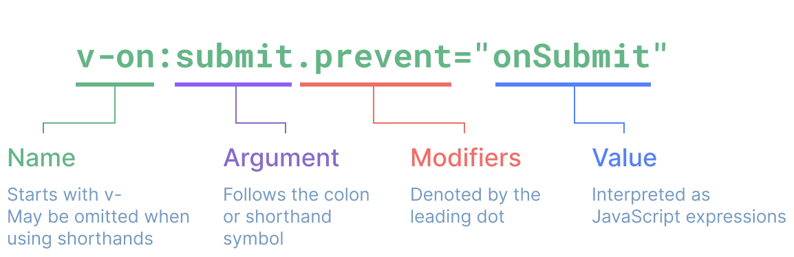
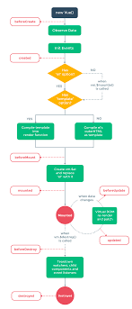

## Vue JS
### Install vuejs 3
https://vuejs.org/guide/quick-start.html#using-vue-from-cdn
#### Use vs code: 
- install plugin live server
### Syntax
- create vue object
```
 <script>
        let app = Vue.createApp({
            data: function (){
                return {
                    greeting: "Hello Vue 3!",
                    isVisible: true,
                }
            }
        })
        app.mount("#app");
    </script>
```
### Directive:
- Directives are special attributes with the v- prefix. 
- Vue provides a number of built-in directives, including v-html and v-bind, v-for, v-if
#### Arguments
- Some directives can take an "argument", denoted by a colon after the directive name. 
- For example, the v-bind directive is used to reactively update an HTML attribute:
```
    <a v-bind:href="url"> ... </a>
    <a :href="url"> ... </a>
    
```
#### Dynamic Arguments
- It is also possible to use a JavaScript expression in a directive argument by wrapping it with square brackets
```
    <a v-bind:[attributeName]="url"> ... </a>
    
    <!-- shorthand -->
    <a :[attributeName]="url"> ... </a>![]

```

- If attributeName whole href -> <a :[href]="url"> ... </a>
- Syntax: 
- Should not use 
+ *<a :[someAttr]="value"> ... </a>* someAttr will convert to someattr 
->  If your component has a someAttr property instead of someattr, your code won't work.
+ 
```
    <a :['foo' + bar]="value"> ... </a>

```
#### v-bind:
- Dynamically Binding Multiple Attributes:
```
    data() {
      return {
        objectOfAttrs: {
          id: 'container',
          class: 'wrapper'
        }
      }
    }
- 
```
#### Javascript expression
```
    {{ number + 1 }}
    
    {{ ok ? 'YES' : 'NO' }}
    
    {{ message.split('').reverse().join('') }}
    
    <div :id="`list-${id}`"></div>
```
- Inside text interpolations (mustaches)
- In the attribute value of any Vue directives (special attributes that start with v-)
#### v-model: bind to variable
#### v-if: set false remove from done
- v-else-if
- v-else
- v-show: giống với v-if nhưng mà ở phần code render ra sẽ có chỉ là style= "display: none"
=> trường hợp nào nên dùng show, if: need use frequent -> hiệu quả hơn là remove rùi add
#### v-cloak
- Hide any thing from rendering until whole vue application is ready
- When vue load have done v-cloak have removed
### Event - Method
- Many events that can be capture in browser and use in application: press key, click button 
#### v-on
- v-on:click -> @click 
- ontoggle:function (){} -> ontoggle(){}
- this: vue put all methods, variable in this
#### @keyup:
- @keyup.enter="greet" -> @keyup.13 => đợi sự kiện có enter => call greet
- @keyup.enter="greet(greeting)" => có thể passing biến
#### @click.right
- @click.prevent.stop
####
- @submit.prevent: prevent chặn các default event -> case này chặn default event reload page khi submit
### Declaring reactive state:
- *data* to declaring reactive state
-  Vue will call when creates vue instance 
- this.a will be equivalent to this.$data.a
- Add new to this.$data is posible but it is not recommended. ->If the desired value of a property is not yet available then an empty value such as undefined or null should be included as a placeholder to ensure that Vue knows that the property exists.
- Not allow to use name properties with *$, _* because they may conflict with Vue's internal properties and API methods. You will have to access them as this.$data._property.

### Custom Component 
- Dưới phần khai báo của vue component 
- Trên mounted
Noted: 
- @submit : khi click form sẽ auto reload form. Là action auto browser
- case bắt sự kiện trong multiselect ????
```
  app.component(
            "custom-form",{
                template:`
                    <form @submit.prevent="handleSubmit">
                    <h1>
                      {{ title }}
                    </h1>
                        <input type = 'email'/>
                        <input type = 'password'/>
                    <button type="submit">Submit</button>
                    </form>
                `,
                data: function (){
                    return {
                        title: "Login Form"
                    }
                },
                methods:{
                    handleSubmit:function (){
                        console.log("Submit")
                    }
                }
            },

        )
```

#### Component pr
- pass data from parent component to child component
```
    <custom-input  v-model="email" :model-value="email" v-bind:label="emailLabel"/>
```
- using v-bind to pass data from variable emailLabel to label
- v-blind: cũng có thể use :
- user *props* in child component list all things passing from parent to child
```
   props:['label','modelValue'],
```
#### Component compute
- pass data from child component to parent component
- user *$emit => ????
- computed: object U can put variable name at key, and whatever that value changed it can run getter and setter
```
 inputValue:{
                        get(){
                            return this.modelValue;
                        },
                        set(value){
                            this.$emit('update:modelValue', value)
                        }
                    }
```
```
 app.component(
            "custom-input",{
                template:
                    `
                <label>
                    {{label}}
                    <input type="text" v-model="inputValue"/>
                </label>
                `,
                props:['label','modelValue'],
                computed:{
                    inputValue:{
                        get(){
                            return this.modelValue;
                        },
                        set(value){
                            this.$emit('update:modelValue', value)
                        }
                    }
                }
                // data:{
                //     inputValue: ""
                // }
            }
        )
```
### Loop 
- *<p v-for="str in inputs" > {{str}}</p>*
### Component Life cycle hooks
#### Hooks: 
- That is the function will be trigger to run at the specific point in the life cycle of the component
- Ex: function will call when item appear or disappear
- Life cycle diagram of vue instance
- 


